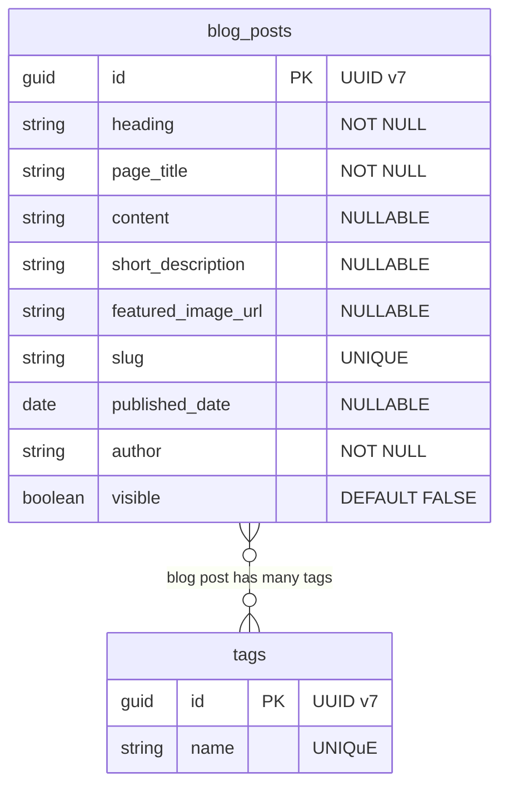

```mermaid
erDiagram
    blog_posts {
        guid id PK "UUID v7"
        string heading "NOT NULL"
        string page_title "NOT NULL"
        string content "NULLABLE"
        string short_description "NULLABLE"
        string featured_image_url "NULLABLE"
        string slug "UNIQUE"
        date published_date "NULLABLE"
        string author "NOT NULL"
        boolean visible "DEFAULT FALSE"
    }
    
    tags {
        guid id PK "UUID v7"
        string name "UNIQuE"
    }
    
    blog_posts }o--o{ tags : "blog post has many tags"
    
    
```